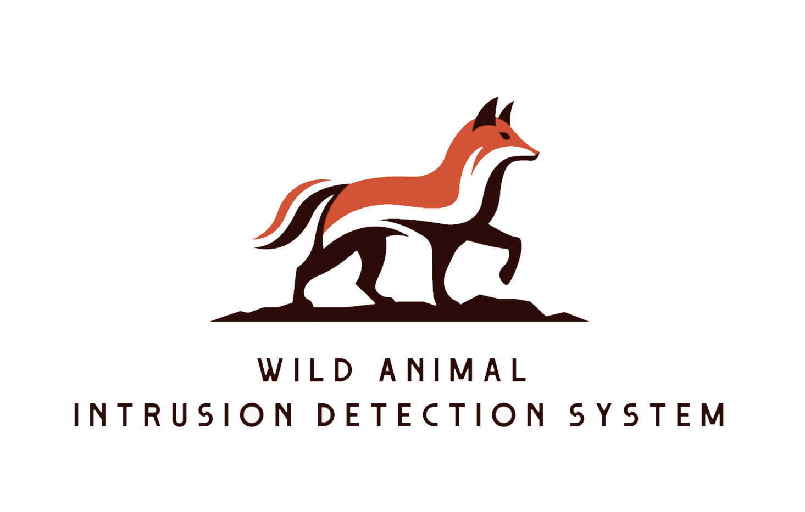
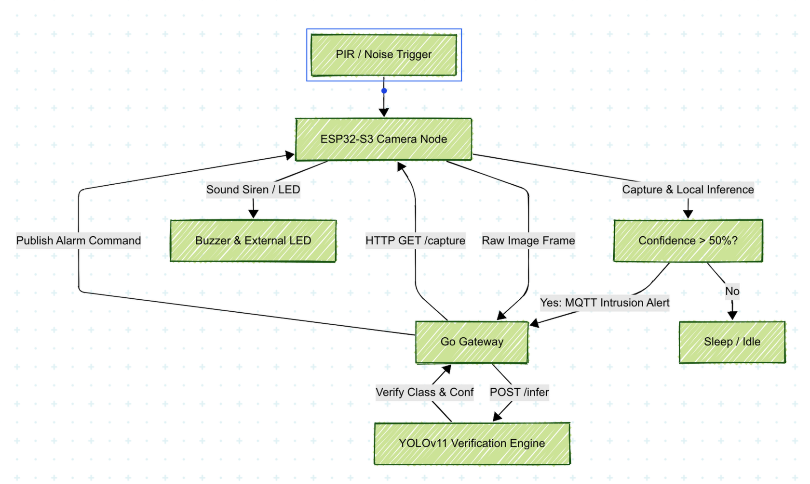
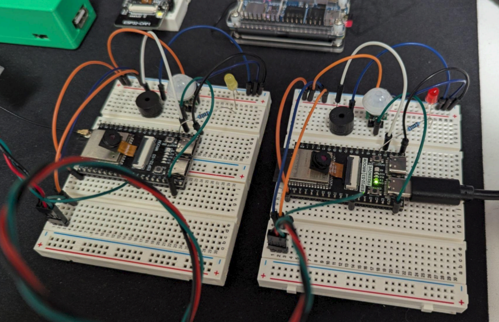

# Wild Animal Intrusion Detection System

This repository implements a wireless sensor network designed for wild animal intrusion detection (specifically targeting foxes, bears, deer, crocodiles, and wolves). The system utilizes a hybrid Edge-Gateway AI architecture to achieve low-latency detection, long-range remote communication, battery-efficient operation, and high-accuracy classification.

---

## 1. System Architecture

Unlike traditional setups that run entirely on the edge (computationally limited) or entirely in the cloud (bandwidth/latency heavy), this project implements a **two-tier verification pipeline**:

### Edge Tier (ESP32-S3 Camera Nodes)
- **Role**: Serves as a first-level sensor and trigger.
- **Operation**: Wakes up from physical triggers (PIR motion sensor or noise threshold exceeded). Once awake, it captures an image and runs local inference using an INT8-quantized MobileNetV1 model.
- **Alert Trigger**: If an animal is classified with $\ge 50\%$ confidence, it publishes an `intrusion` event containing the predicted label and score to the central MQTT broker. It then hosts the captured frame on a local HTTP server (`/capture`).

### Gateway Tier (Orange Pi / PC)
- **Role**: Serves as the central hub and high-precision verifier.
- **Operation**: The Go-based Gateway listens on the MQTT topic. When an `intrusion` event is received, it pulls the raw frame from the edge node's `/capture` endpoint.
- **Verification**: It forwards the image to a Flask-based YOLOv11 classification service (`gateway-yolo-inference`) for secondary verification using a full-scale model (`yolo11x-cls.pt`).
- **Notification & Alarm**: If the YOLO model confirms the animal classification, the gateway triggers corresponding rules (e.g., executing `fox_callback`) to publish an alarm event back to the edge node (turning on sirens, LEDs) and logging the incident in a database.

### Dual Communication Pathways
- **WiFi/MQTT Link**: Camera nodes can connect directly via local WiFi to publish and subscribe to MQTT topics.
- **nRF24L01 Radio Link**: For deployments in remote fields where WiFi is unavailable, nodes communicate over low-power nRF24L01 radio links. A dedicated Python gateway service ([gateway-nrf24](./gateway-nrf24)) running on an Orange Pi bridges the radio packets to the MQTT broker.

---

## 2. Model Training & Quantization Pipeline

The edge classifier was trained and quantized to fit within the ESP32-S3 microcontroller parameters. The notebooks and scripts are located in the [notebooks/](./notebooks/) and [bash_scripts/](./bash_scripts/) folders.

### Dataset Preparation
- **Renaming**: Image filenames are sanitized and standardized with unique UUIDs using [rename.sh](./bash_scripts/rename.sh) to prevent folder-level name collisions.
- **Resizing & Grayscale Conversion**: To suit MCU memory constraints, source images are converted to 1-channel grayscale and resized to 96x96 pixels using [resize_to_96x96_greyscale.sh](./bash_scripts/resize_to_96x96_greyscale.sh).
- **Index Generation**: Path mapping is automated via [csv_generator.sh](./bash_scripts/csv_generator.sh) which parses the structured subfolders and compiles absolute image paths and labels into a CSV.

### Data Augmentation & Balancing
- In [train_mobilenet_v3.ipynb](./notebooks/train_mobilenet_v3.ipynb), data imbalance is addressed using an Albumentations pipeline (HorizontalFlip, Rotate, BrightnessContrast, Gamma, RandomCrop) to augment minority classes up to a balanced class distribution before training.

### Model Architecture & Training
- The base model architecture is MobileNetV1/MobileNetV3-Small.
- Optimization uses Adamax with a starting learning rate of 0.001. Early stopping is applied through a custom Keras callback to save history and restore the best model weights.

### Post-Training Integer Quantization (INT8)
- The trained Keras model is converted using Keras's `TFLiteConverter` with post-training integer-only quantization activated.
- A representative dataset generator is passed to calibrate the activation layers' dynamic ranges, mapping float32 weights to signed 8-bit integers (`int8` inputs, weights, and `uint8` outputs).
- **Quantization Fix**: TFLite Converters can sometimes write invalid serialization metadata (e.g. assigning the 4D weight tensor's channel dimension index `3` as the quantization axis for 1D bias tensors). The project includes a utility script ([find_quantization_offsets.py](./find_quantization_offsets.py)) that parses the model flatbuffer and patches `quantizedDimension` to `0` for 1D bias tensors, allowing the model to load successfully on modern TFLite runtimes.

---

## 3. Suitability & Optimization for ESP32-S3

The edge nodes run the TFLite Micro framework optimized for the ESP32-S3:

- **Memory Constraints**:
  - The quantized MobileNetV1 binary occupies only ~300 KB of SPI flash memory.
  - The model runs inside a small 136 KB `tensor_arena` allocated from internal SRAM/PSRAM.
- **Compute Optimization**:
  - **Grayscale 1-Channel Input**: Converting images to grayscale (`96x96x1` vs RGB `96x96x3`) reduces peak memory usage and increases inference speed on the ESP32 CPU.
  - **INT8 Arithmetic**: Uses signed 8-bit integer weights, allowing the model to leverage the ESP32-S3's hardware-accelerated vector instructions (CMSIS-NN/ESP-NN) for fast tensor arithmetic.
  - **Pruned Operator Resolver**: Minimizes binary code size by registering only the required operators:
    - `AddAveragePool2D()`
    - `AddConv2D()`
    - `AddDepthwiseConv2D()`
    - `AddReshape()`
    - `AddSoftmax()`
- **Low-Power WSN Model**:
  - Camera nodes do not run inference continuously. They remain in an idle/low-power state until woken up by the PIR motion sensor or an acoustic noise detector, preserving battery charge.

- **Actual hardware**:

---

## 4. Directory Structure & Modules

- [base-firmware/](./base-firmware): PlatformIO ESP32-S3 camera node firmware. Contains the camera driver, local TFLite Micro interpreter, and MQTT client.
- [bash_scripts/](./bash_scripts): Bash scripts used for dataset preprocessing (renaming, resizing, and CSV index generation).
- [gateway/](./gateway): Central Smart Gateway written in Go. Manages sqlite telemetry logs, MQTT subscriptions, client configurations, and rules callbacks.
- [gateway-nrf24/](./gateway-nrf24): Python gateway bridging the low-power nRF24L01 radio link to the MQTT broker.
- [gateway-yolo-inference/](./gateway-yolo-inference): Flask-based YOLOv11 inference service that validates edge camera events.
- [notebooks/](./notebooks): Jupyter Notebooks used for model training, post-training integer quantization, and YOLO verification tests.
- [pcb/](./pcb): Altium Designer PCB project (`Edge_ESP32.PrjPcb`) for the custom camera node board.
- [training_data/](./training_data): Training outputs and evaluations of the 5-class animal classifier model (confusion matrix, epoch history, and classification reports).
